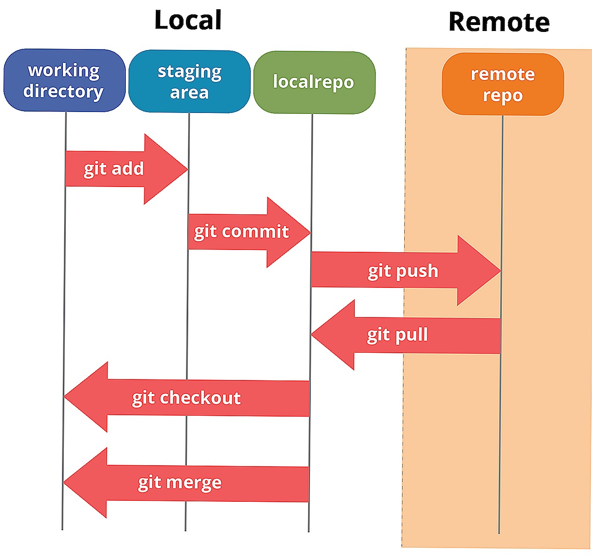

## Первоначальная настройка GIT
***выполняется после того, как git был установлен на компьютер или при необходимости внести изменения***
Установить/изменить имя пользователя

    git config --global user.name "Ваше Имя"

Установить/изменить email пользователя

    git config --global user.email ваша@почта.com
Просмотр настроек пользователя

    git config --list
Превратить каталог, который не находится под версионным контролем , в репозитрарии Git

    git init
После того как была создана папка .git добавляем в текущей каталог файл .gitignore В него заносим все файлы и папки которые не хотим индексировать

Индексировать измененный файл

    git add
Индексировать измененные файлы

    git add .
Удаление индексации файла

    git rm –cashed "имя_файла"
Удаление из индекса и из проекта

    git rm -f "имя_файла"
Просмотр изменений

    git status
Фиксация изменения в локальное хранилище
В коммит попадут (будут сохранены) только файлы,
В коммит попадут (будут сохранены) только файлы,

    git commit -m "комментарии к коду"
Просмотр истории коммитов

    git log
Информация о коммите (метаданные):
уникальный идентификатор коммита (хеш);
имя и email автора коммита;
дата создания коммита;
комментарий к коммиту.

Связываение локального репозитория с GitHub

    git remote add origin git@github.com:my_name/my_repo.git

Где 

    my_name – имя пользователя на GitHub
    my_repo – название созданного репозитория
Проверка свызывания

    git remote get-url origin

Удаление свызывания
    
    git remote remove origin

Отправка изменений в удаленный
репозиторий origin ветки master

    git push origin master
Отправка изменений c текущей ветки

    git push
Получение изменений

    git pull

Клонировать существующий репозиторий

    git clone ссылка-на-репозиторий

Управление репозиторием
Git сводится к набору
команд.
Рассмотрим диаграмму.
